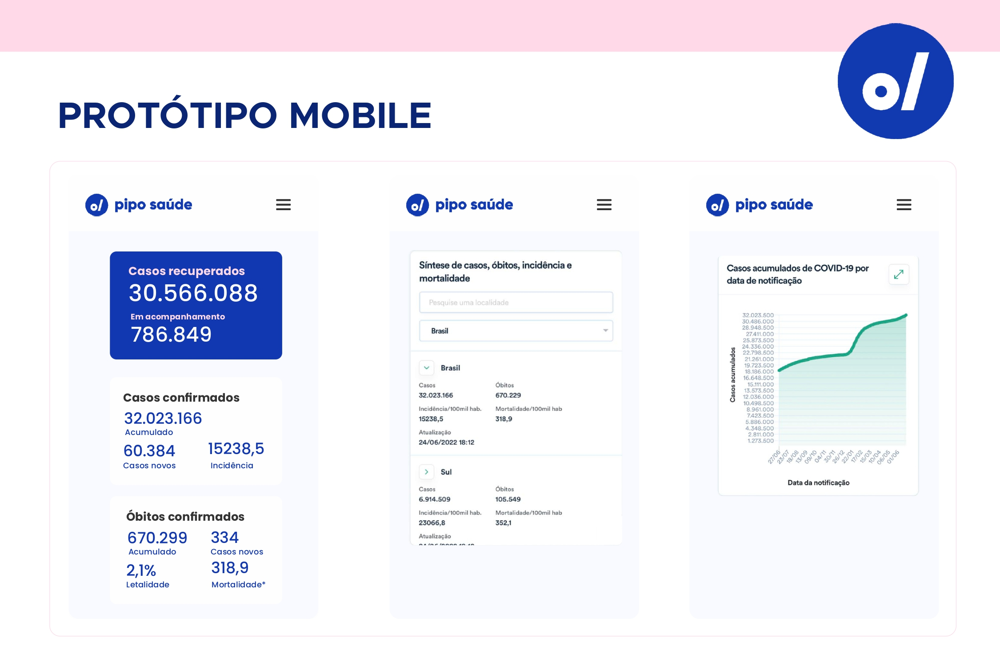
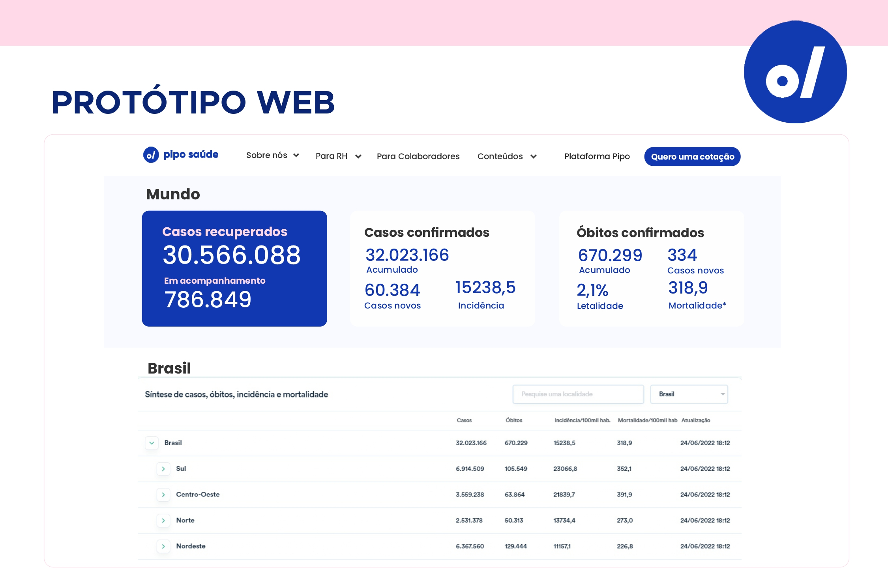
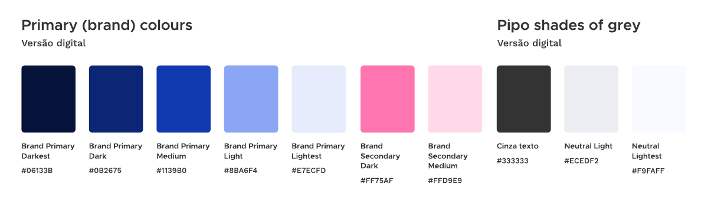

# Painel Estatístico COVID19 - Pipo Saúde

## Índice

  - [Índice](#índice)
  - [1. Pipo Saúde](#1-pipo-saúde)
  - [2. Desafio](#2-desafio)
  - [3. Metodologia Ágil](#3-metodologia-ágil)
  - [4. Features do Produto Mínimo Viável (MVP)](#4-features-do-produto-mínimo-viável-(MVP))
  - [5. Protótipo](#5-protótipo)
  - [6. Ferramentas Utilizadas](#6-ferramentas-utilizadas)
  - [7. Como usar](#7-como-usar)
  - [8. Desenvolvedoras](#8-desenvolvedoras)
***

## 1. Pipo Saúde

A **Pipo Saúde** é uma corretora de benefícios de saúde que apoia o RH e oferece uma experiência incrível aos colaboradores, otimizando a relação das empresas na compra e gestão de benefícios.

Conhecer mais sobre a Pipo aqui [AQUI](https://www.piposaude.com.br/).

## 2. Desafio

A Pipo Saúde é uma corretora de benefícios de saúde que apoia o RH e oferece uma experiência incrível aos colaboradores, otimizando a relação das empresas na compra e gestão de benefícios.
Fomos desafiadas pela Pipo a desenvolver uma aplicação web que permitisse aos usuários acompanharem o histórico de estatísticas do Covid-19 no Brasil e no mundo, assim como as últimas atualizações em tempo real.
A ideia é que o usuário seja capaz de visualizar o progresso da pandemia em diferentes países. 
Para isso, seria interessante que a aplicação fornecesse dados como, por exemplo, número de óbitos, número total de casos, número de novos casos, entre outros dados relevantes.
Seria ainda mais incrível se no caso do Brasil, pudéssemos filtrar os dados por estado, ou filtrar os dados em um intervalo temporal, por exemplo.
A aplicação deve ser capaz de exibir os dados em tabelas, gráficos e geocharts. O grupo deve definir qual a melhor experiência de usuário que permita-o visualizar asestatísticas nesses formatos distintos.

Conhecer nossa solução [AQUI](https://cassiacosta.github.io/piposaude-estatisticas-covid/).

## 3. Metodologia Ágil

Utilizamos o Trello para nos organizarmos durante o quatro dias de hackathon, e cada dia foi considerado uma sprint do projeto. 

Com a criação do Backlog com as funcionalidades sugeridas e as principais, e a divisão e priorização das atividades a serem desenvolvidas, a partir deste Backlog. Assim como as cerimonias da metodologia ágil: Daily (Squad e Equipe Pipo), Sprint Planning (Squad) e Sprint Review (Squad). 

Link do trello do projeto [AQUI](https://trello.com/b/PaMwSxcZ/pipo-talent-fest).

A estrategia seguida para definir os requisitos e a priorização da implementação de cada um, foi feita seguindo os feedbacks da equipe da Pipo durante as Dailys, além de uma ordem logica, alcançando primeiro objetivos primordiais do desafio e que causavam dependencia nos demais requisitos.

## 4. Features do Produto Mínimo Viável (MVP)

- [x] **Consumo de API com histórico de estatísticas da COVID por país.**
- [x] **Para a API mundo, foi desenvolvido filtro por país.**
- [x] **Para a API mundo, foi desenvolvido calculo agregado mostrando três estatísticas, número de óbitos, casos totais, novos casos.**
- [x] **Consumo de API com histórico de estatísticas da COVID do Brasil.**
- [x] **Para a API Brasil, foi desenvolvido filtro por estado.** 
- [x] **Para a API Brasil, foi desenvolvido filtro por periodo de 3 semanas e 6 semanas.** 
- [x] **Consumo de biblioteca de gráficos da Google.**
- [x] **Exibição dos dados dos países em tabela com casos, novos casos e óbitos.**
- [x] **Exibição dos dados do Brasil em tabelas para filtro de estado e periodo.**
- [x] **Exibição dos dados do Brasil em grafico para casos, óbitos e suspeitos.**
- [x] **Mobile-First.**
- [x] **Responsividade.**
- [x] **Deploy em hosting público - GitHub Pages.**

## 5. Protótipos

Para criação dos Protótipos desenvolvidos usamos as ferramentas Adobe Illustrator e Adobe Photoshop.

### 5.1 Paleta de Cores

A paleta de cores foi definida seguindo o guia da marca.

## 6. Ferramentas Utilizadas

- **HTML**;
- **CSS**;
- **ReactJS**;
- **NodeJS**;
- **Git e GitHub**;
- **API de Dados**
- **Trello**;

## 7. Como usar

Você precisará usar o Node.js

Clonar o projeto

` $ git clone https://github.com/CassiaCosta/piposaude-estatisticas-covid`

Instalar as dependências do projeto

` $ npm install or yarn`

Iniciar a aplicação

` $ npm start or yarn start`

---
## 8. Desenvolvedoras

Este projeto foi desenvolvido durante o Talent Fest da Laboratória, Turma 007 pelas colaboradoras:

<table>
  <tr>
    <td>
         
      

        <a href="https://www.linkedin.com/in/aline-rosa-cruz/" _blank>Aline Rosa Cruz</a>
      

    </td>
    <td>
            
      

        <a href="https://www.linkedin.com/in/camila-aguiar-santiago/" _blank>Camila Aguiar</a>
      

    </td>    
    <td>
               
      

        <a href="https://www.linkedin.com/in/cassia-costa/" _blank> Cássia Costa </a>
      

    </td>
    <td>
              
      

        <a href="https://www.linkedin.com/in/elizenai/" _blank>Elizenai Silva</a>
      

    </td>    
    <td>
        
      

        <a href="https://www.linkedin.com/in/karolsontak/" _blank>Karol Sontak</a>
      

    </td>
  </tr>
</table>